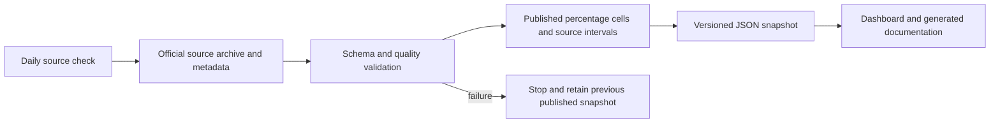

# Process flows

Questions select a governed indicator and exact published population, then retrieve matching cells. A model can assist selection but cannot create the displayed estimate. Unsupported measures and individual targeting are refused. Dashboard questions use the visible population and year controls.

Refresh distinguishes observation year, source release date and download timestamp. An unchanged archive and metadata do not create a new published data version.
