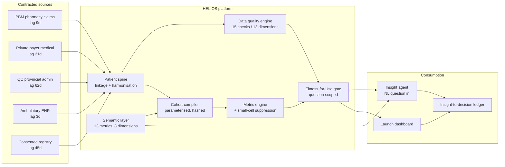
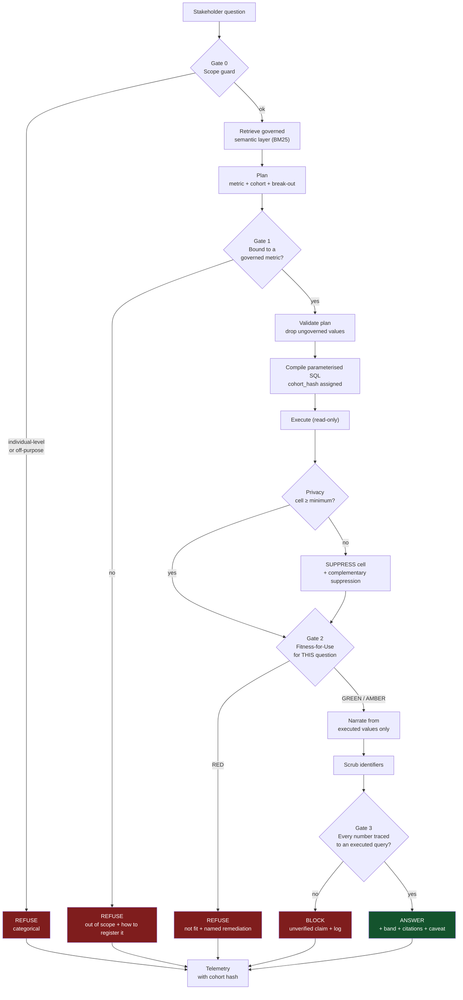
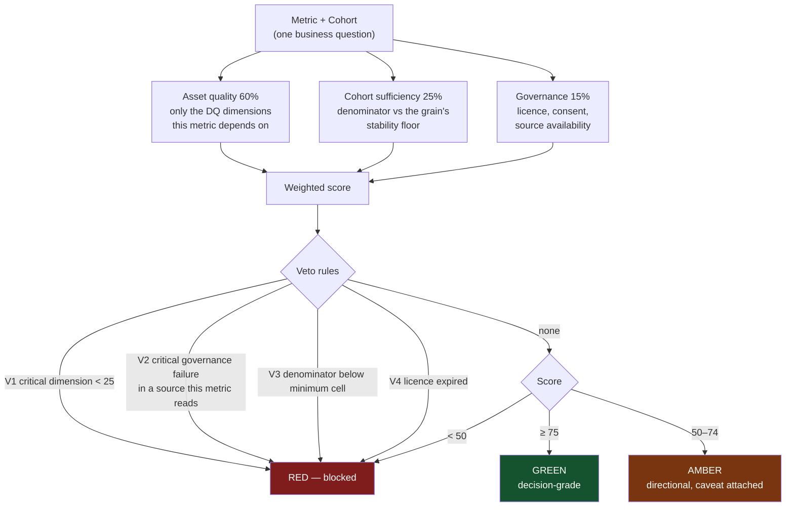
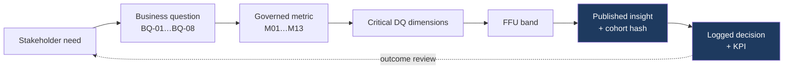
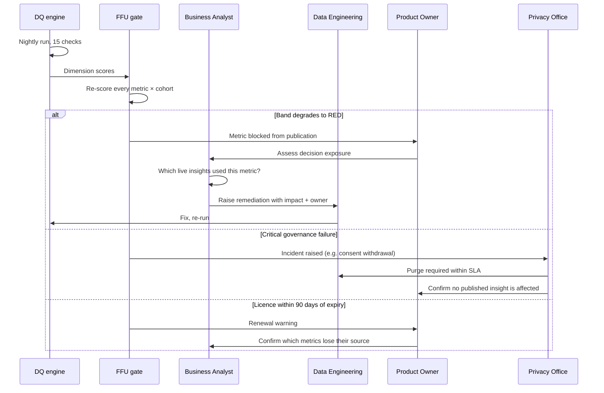
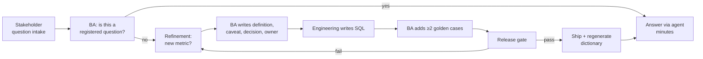

# HELIOS — Process Flows & Architecture

Diagrams are Mermaid and render in Confluence, GitHub and the published
dashboard.

---

## 1. End-to-end data and decision flow

---

## 2. The agent request pipeline — every gate that can stop an answer

**The point of the diagram:** four of the five terminal states are refusals.
That ratio is deliberate. A product that answers everything is a product that
answers some things wrongly.

---

## 3. Fitness-for-Use scoring

**Why vetoes rather than a pure weighted score:** some failures are not
tradeable against a good average. A consent breach is not offset by excellent
completeness. A score alone would let it be.

---

## 4. Requirements traceability

Both ends are machine-readable, so the chain can be walked in either
direction — from a decision back to the patients behind it, or from a data
defect forward to every decision it touches. The second direction is the one
that matters when a defect is found late.

---

## 5. Governance: what happens when a check fails

---

## 6. Sprint operating rhythm

The loop that matters is `B → D → E`: an unanswerable question is not a
failure, it is the intake mechanism for the next metric. The refusal text
tells the user exactly that.
